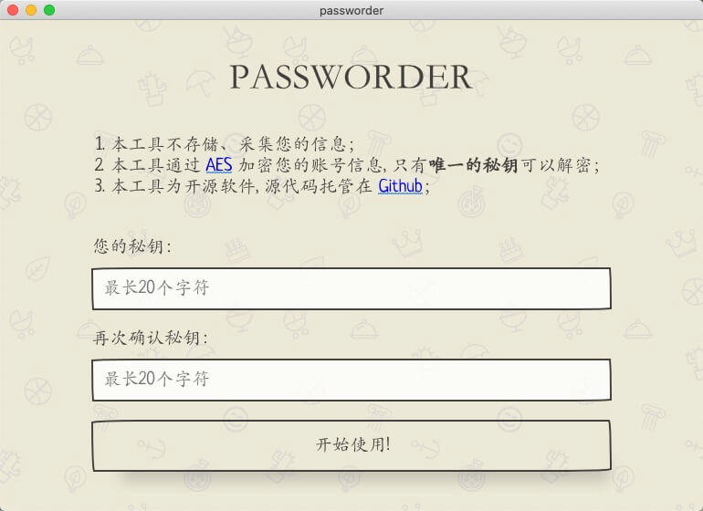
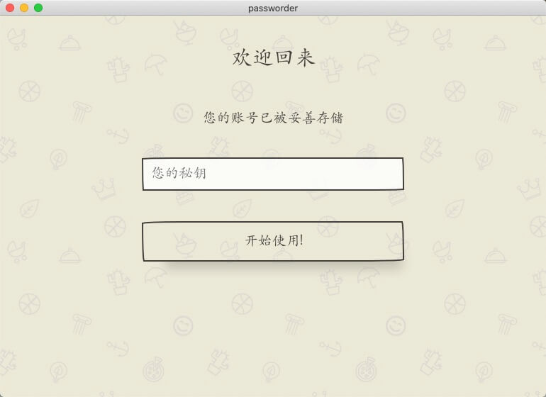
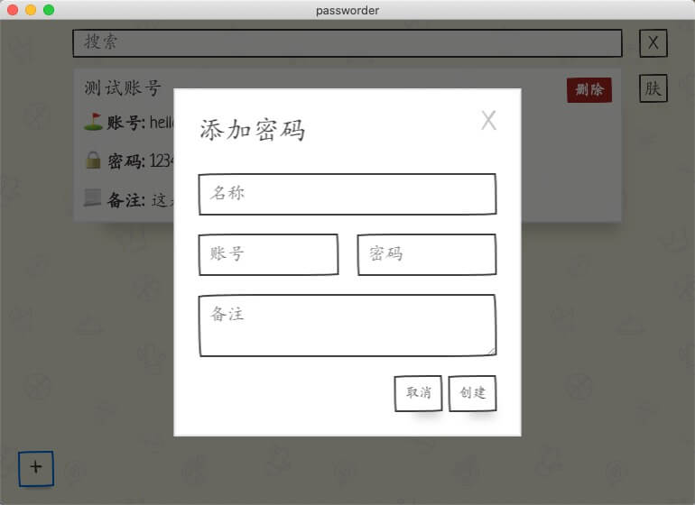
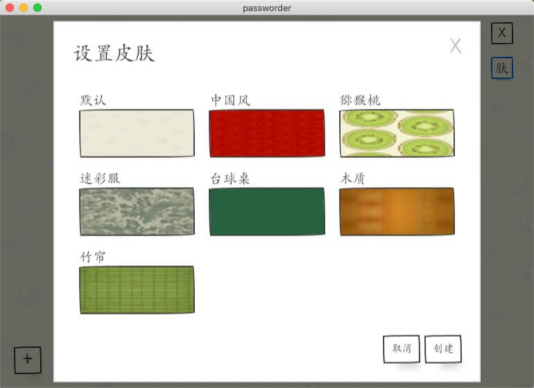

# 密码管理器

> A Simple Password Manager

相关文章: [花了半天时间, 实现了一个简易的密码管理器](http://poppython.com/blog/passworder-released.html)

## 预览









## 开发

```shell script
git clone https://github.com/rmlzy/passworder.git
cd passworder

# 注意不要使用 cnpm
npm i 

npm run dev
```

## 打包

```shell script
npm run build:dir
```

## TODO
+ [ ] 支持自定义路径
+ [ ] 支持多语言

## LICENSE
MIT
